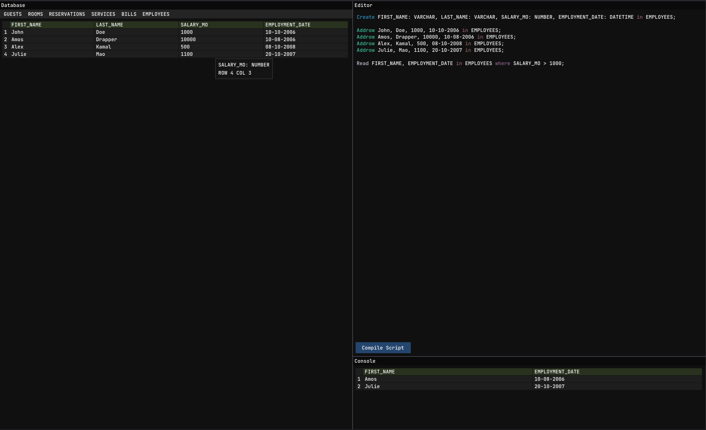

# MyDatabase

> *A look at the main MyDatabase visual interface.*

** OUTDATED ** //

**MyDatabase** is a custom database manager featuring a bespoke SQL-like query compiler and a visual interface. Built heavily on object-oriented C++ principles, the project handles everything from memory-safe CRUD operations to custom token parsing using Deterministic Finite Automata (DFA).

## Key Features

*   **Visual Interface:** Provides an interactive graphical frontend powered by Dear ImGui and GLFW. The interface consists of specialized components like the `DatabaseWindow` for viewing table data and the `EditorWindow` for writing queries. 
*   **Custom Query Interpreter:** Acts as a custom "SQL-like" engine. It utilizes a `Lexer` to break queries into tokens and an `Interpreter` backed by DFA state machines to validate and execute commands safely.
*   **Strict Type Validation:** Ensures data integrity by strictly validating cell contents. Supported data types include:
    *   **`VARCHAR`**: Standard text strings.
    *   **`NUMBER`**: Numeric values only.
    *   **`DATETIME`**: Strictly enforced format of `DD-MM-YYYY`.
*   **Robust Error Handling:** Uses custom C++ runtime exceptions like `TableDataError` (when input size does not match table columns) and `CellDataError` (when invalid data is passed to a strictly typed cell) to prevent database corruption.
*   **Singleton & Component-based CRUD:** Employs a robust architectural design using the Singleton pattern for the `Database`, `Crud`, and `Interpreter` instances. The `Crud` system uses multiple inheritance to seamlessly combine modular `Create`, `Read`, `Update`, and `Delete` operations.

## Supported Query Syntax

The custom interpreter understands the following command structures, using `in` as a destination token and supporting `where` and `orderby` filters:

*   **Create Table:** `CREATE h1:VARCHAR, h2:NUMBER, ... in TABLE_NAME`
*   **Insert Data:** `ADDROW c1, c2, ... in TABLE_NAME`
*   **Delete Row:** `DELROW [row_index/key] in TABLE_NAME`
*   **Read Data:** `READ h1, h2, ... in TABLE_NAME where [condition] orderby [ascending/descending]`

## Project Structure

The codebase is organized into highly modular directories:
*   **`src/Database/`**: Contains the core data models (`Database`, `Table`, `Row`, `Cell`, and polymorphic `DataType` classes).
*   **`src/Crud/`**: Houses the database connection logic and independent operation classes (`Create`, `Read`, `Update`, `Delete`).
*   **`src/Interpreter/`**: Contains the custom parsing engine (`Lexer`, `Dfa`, `Interpreter`, and `Query` structures).
*   **`src/Interface/`**: Manages the graphical window rendering and state tracking.
*   **`src/Misc/` & `src/Error/`**: Contains custom exception definitions and the `Parser` utilities for string manipulation and formatting.

## Dependencies & Building

To build and run the project, the following dependencies are required:
*   **Dear ImGui** (Included in `external/imgui`)
*   **GLFW** (Graphics Library Framework) development toolkit